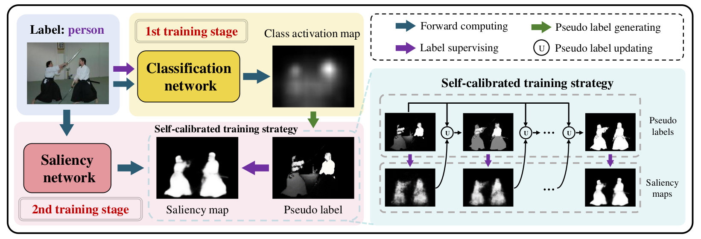

# SCW

Source code for the Paper:
 **"To be Critical: Self-Calibrated Weakly Supervised Learning for Salient Object Detection. "**

 **Jian Wang**, Miao Zhang, Yongri Piao, ZhengXuan Ma and HuChuan Lu. IIAU-OIP Lab.

The paper is under review, we will release the PDF upon accepted.

<center>

</center>
<br /><br /><br /><br /><br /><br /><br /><br /><br /><br />

## Prerequisites

### environment

* CUDA 10.1
* pytorch 1.7.1
* python 3.7.11
* the others can be found in requirements.txt

### training data
our proposed DUTS-Cls dataset can be found in [here](https://pan.baidu.com/s/1II4GlcabnJlJ1Ly_DT7XCQ). code: gpt7

DUTS dataset can be found in [here](http://saliencydetection.net/duts/), noting that as a weakly-supervised work, our method only use it's RGB images.

puts the two above datasets in ```.data/```, named as ```.DUTScls-44/``` and ```.DUTS-train/image/```, respectively.

### testing data
link: https://pan.baidu.com/s/1PBzDP1Hnf3RIvpARmxn2yA. code: oipw

## Training & Testing

### Training

```Run main.py```

here you can adjust the training schedule (such as: learning rate, batchsize, the epoch number of each stage, etc.) in this file.

### Testing

```Run test_code.py```

configure the ```--test_root``` as the path of your targeted testset.

the evaluation code can be found in [here](https://github.com/jiwei0921/Saliency-Evaluation-Toolbox).

## Saliency maps & Checkpoint

### saliency maps

link: https://pan.baidu.com/s/1neboLDAs55DHsmsEO4mv4w.  code: rvb0
### checkpoint

link: https://pan.baidu.com/s/1oywOIqKPMRQrfogNsMXcrA.  code: kuih

## Acknowledge

Thanks to pioneering helpful works:

* [SSSS](https://github.com/visinf/1-stage-wseg):  Single-stage Semantic Segmentation from Image Labels, CVPR2020, by Nikita Araslanov et al.
* [IRNet](https://github.com/jiwoon-ahn/irn):  Weakly Supervised Learning of Instance Segmentation with Inter-pixel Relations, CVPR2019, by Jiwoon Ahn et al.

## Citation

We really hope this repo can contribute the conmunity, and if you find this work useful, please use the following citation:

```
@article{Wang_SCW,
  author    = {Jian Wang, Miao Zhang, Yongri Piao, Zhengxuan Ma and Huchuan Lu},
  title     = {To be Critical: Self-Calibrated Weakly Supervised Learning for Salient Object Detection},
  year      = {2021},
  url       = {https://arxiv.org/abs/2109.01770},
  eprinttype = {arXiv},
  eprint    = {2109.01770},
}
```
If you have any questions, please contact me by e-mail: [jiangnanyimi@163.com](jiangnanyimi@163.com).
